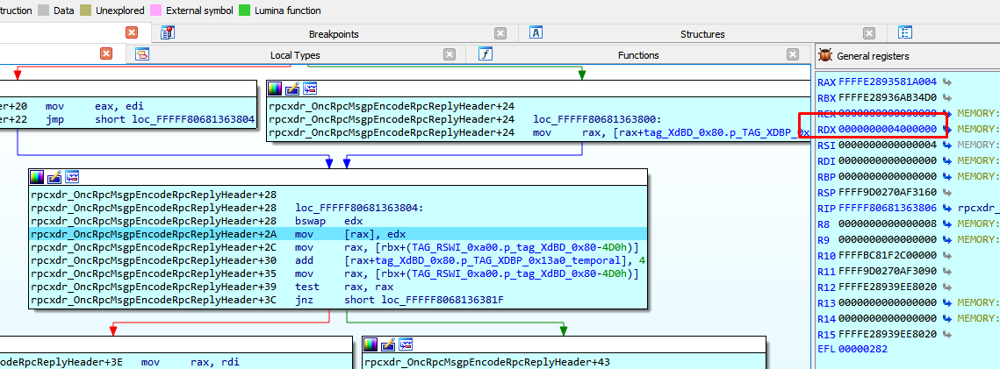
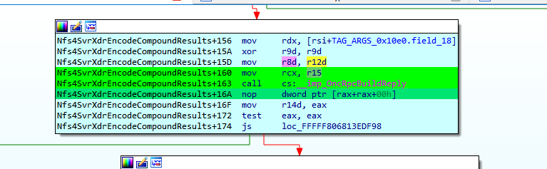

# CVE-2022-30136 Windows Network File System Remote exploit PoC

author: [Ricardo Narvaja](https://twitter.com/ricnar456)

For demonstration purposes only. Complete exploit works on vulnerable Windows Server systems.

Checkout the writeup [Analysis of CVE-2022-30136 “Windows Network File System Vulnerability“](https://www.coresecurity.com/core-labs/articles/analysis-cve-2022-30136-windows-network-file-system-vulnerability).

# Usage

## Analysis of CVE-2022-22029 “Windows Network File System vulnerability“

I wanted to write this article to demonstrate the analysis I did while developing the Core Impact exploit “Windows Network File System Remote” that abuses the [CVE-2022-30136](https://nvd.nist.gov/vuln/detail/CVE-2022-30136) vulnerability.

### 1)The Vulnerability

The Windows Network File System Remote Code Execution vulnerability is a size calculation error that occurs when creating the server response in a COMPOUND REQUEST using version 4.1 of NFS.

The server calculates a smaller size than necessary to allocate the pool, and then, when copying the data to generate the response, overflows the buffer.

The function **Nfs4SvrXdrpGetEncodeOperationResultByteCount** in **nfssvr.sys** is called for each operation and returns a size that is smaller than necessary (4 bytes less for each operation).

### 2)The Patch

A patch was made for **Nfs4SvrXdrpGetEncodeOperationResultByteCount**.

This function is called during each OPERATION of a COMPOSE REQUEST so that it returns the bytes needed for each of them based on the OPCODE. It is then added to the header and other parts of the response. Next, it calculates the final size of the entire response to allocate and then copies on it to reply.

In each case, we can see that the value of the size returned for each operation is four bytes smaller in the vulnerable version than the patched version.

### 3)The Diff

I build the POC for Windows server 2019.

Below is the vulnerable version of nfssvr.sys used for this POC, followed by the patched version for Windows server 2019:

The next image shows CASE 26 in the diff:

In the example of CASE 26, we can see that the constant added to the calculated value is 0x2c in the vulnerable version, and 0x30 in the patched version.

The same can be seen in each case corresponding to each OPCODE. The vulnerable one always returns a size four bytes smaller than the patched one.

We are not going to show all the cases because the patch is similar for all OPCODES.

### 4)The usage of the Miscalculated Value

The parent of **Nfs4SvrXdrpGetEncodeOperationResultByteCount** is **Nfs4SvrXdrEncodeCompoundResults**. It reads the number of operations sent in the COMPOUND REQUEST.

In this POC the value is 0x34 (52d). When my POC connects to the server to the port 2049 (the default port to NFS), I need to place a conditional breakpoint for a stop.

In this instance, it stops when number_of_operations=0x34.

The pool with tag ARGS is allocated here.

I will then create a structure named TAG_ARGS_0x10e0 to reverse the fields.

It copies the number_of_operations into r13 and loops into the vulnerable function once per operation, until the counter reaches the value of r13.

It shows that the first package_OPCODE= 0x35, which corresponds to SEQUENCE in the first mandatory operation in a COMPOUND REQUEST. In the image below, the arrow points to this OPCODE in my package.

Here we can see the arguments of the vulnerable function.

Inside the vulnerable function it reads the OPCODE and goes to the corresponding CASE.

Three is subtracted from the original OPCODE value (53).

And jumps to CASE 50, returning 0x28 to the necessary size for this operation.

We can see in the diff how the patched version returns 0x2c.

This returned value is added to the previous value of other fields in the response in order to calculate the size of the operations. In this case, this value is 0X40c.

Below we can see the values being added:

When it exits the loop, the total size is calculated. In this case, the total size is 0x1310.

We can guess the difference between the vulnerable version and the patched version by calculating the size, using the formula: **number_of_operations * 4**.

**In this case the allocation in the patched version will be 0x34 * 4 = 0x68 bigger than the vulnerable version.**

After that it adds 0x24. This value is calculated in similar way in both vulnerable and patched versions.

It then adds the constant 0xf in both cases.

Up to this point, the size in this example has been 0x1340.

Next it reaches rpcxdr_OncRpcBufMgrpAllocate.

It then moves to r15.

It subtracts one and adds four. It then compares with 0x800.

This miscalculated size is only used if it is bigger than 0x800. For this reason, only a COMPOUND REQUEST will trigger the bug.

First it allocates a pool with the size = 0x80 and the tag XdBD.

Finally, it allocates the pool for the reply here with the size 0x1398, which adds some constant values.

It then allocates 0x13a0 (including tag XdBP and header).

From there, it stores the address of the new allocated pool in the field: **tag_XdBD_0x80.p_TAG_XDBP_0x13a0**.

This points to the address of the reply it is always copying to.

Then it will start to build the reply header.

The following is an example of how it saves the data to the contain of a temporal pointer and adds four to it.

Below we can see how it copies to the contents of the reply address.

This writes the first dword and it increases the pointer by four.

Next it writes the second dword and adds four.

After exiting the function, the entire header is written.

After that It returns to nfssvr.sys to continue writing the reply.

It will continue decoding and writing in the reply, adding four to the temporal pointer.

When it completes the header, it reaches this loop to write all operations. It begins with the first OPCODE 0x35.

We can see it writes 0x428 from the start of the pool.

Now it points after the tag.

By putting a breakpoint here, we can see how all the operations were written.

After exiting the loop all operations are copied.

Let’s check the end of the pool.

There we can see the write after the limit.

The allocation is smaller than the data copied, producing a pool overflow.

This produces a BSOD in the target machine. However, the question is, can we achieve a Remote Code execution, or a Write what where?

I tried a number of opcode combinations to get a reply with a controlled data in the overflowed bytes. Unfortunately, I had no luck.

The maximum tag (controlled by me) only can be placed at the start and has a 0x400 maximum size.

All the other opcodes I tried do not reply with controlled data. Consequently, I don’t think it’s possible or, at the very least, is incredibly difficult get a RCE or elevate privileges with this bug. That said, it may still be possible, as I did not try all the combinations among the great number of possibilities that exist.

### 5) The built of the POC.

For the build of the POC I tried with a client named “NFS CLIENT.” It supports NFS 4.1 and I was able to try different opcodes copying files, editing, creating folders etc.

In this build, I could make a COMPOUND sample package and adjust the size, the client id, the session id etc.

Next, I sent an EXCHANGE_ID to get the client id, using it to send a CREATE_SESSION and finally the big COMPOUND REQUEST.

At this point we have bug exploited, it leads to a Remote Code Execution allowing a DoS attack.

We hope you find it useful, if you have any doubt can contact us at [Ricardo.narvaja@fortra.com](mailto:Ricardo.narvaja@fortra.com).

Enjoy!
